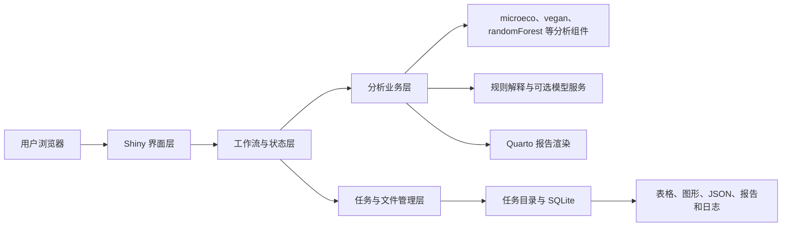
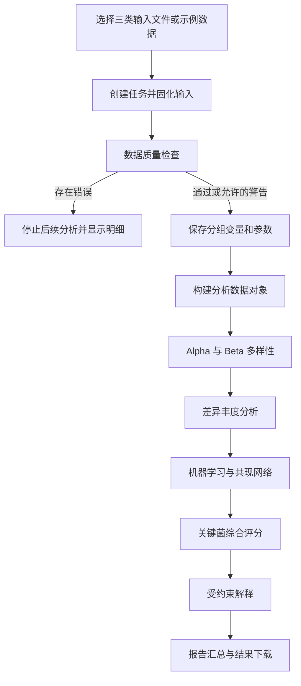

# 微生物组关键菌筛选与可信解释系统 V1.0

## 系统设计说明书

## 1. 设计目标

系统采用 R Shiny 构建单机 Web 应用，在保留 R 生态分析能力的同时，将数据导入、质量检查、统计分析、候选排序、解释生成和报告输出组织为统一流程。设计重点是模块化、任务隔离、产物落盘、状态可见和结果可追溯。

## 2. 总体架构



### 2.1 界面层

`app.R` 负责导航和模块组装，`modules/` 保存各页面的 UI 与服务逻辑。界面层读取任务状态、收集用户输入并调用业务函数，不承担底层统计计算。

### 2.2 工作流与状态层

`R/workflow_state.R` 管理活动任务、阶段状态和界面共享状态；`R/workflow_run.R` 编排数据检查、数据集构建、各分析模块、解释生成和报告渲染。

### 2.3 分析业务层

`R/` 下的分析文件接收普通 R 参数，返回普通列表，并将规定产物写入任务目录。核心文件包括：

- `data_import.R`、`data_check.R`：数据读取与检查；
- `build_microeco.R`：分析数据对象构建；
- `analysis_alpha.R`、`analysis_beta.R`、`analysis_diff.R`：多样性和差异分析；
- `analysis_ml.R`、`analysis_network.R`：机器学习和网络分析；
- `key_taxa_score.R`：多证据综合评分；
- `ai_rules.R`、`ai_prompt.R`、`ai_client.R`、`ai_interpretation.R`：解释约束和可选模型调用；
- `report_prepare.R`、`report_render.R`：报告上下文准备与渲染。

### 2.4 存储层

文件系统保存完整任务产物；SQLite 用于记录任务和文件元信息。文件产物是复核与交付的主要依据，数据库不替代任务目录。

## 3. 页面模块设计

| 页面 | 主要职责 |
|---|---|
| 首页 | 软件说明、流程引导和快捷入口 |
| 快速开始 | 在一个页面完成数据选择、检查、运行和状态查看 |
| 示例模式 | 使用内置示例数据创建演示任务 |
| 结果总览 | 汇总当前任务状态、核心指标、图表和文件 |
| 报告中心 | 生成、打开和下载报告及结果包 |
| 历史任务 | 浏览、加载和管理既有任务 |
| 更多功能 | 提供上传、检查、参数、单项分析和解释页面 |

模块通过共享的工作流状态获取当前任务，不直接互相读取内部响应式对象。

## 4. 核心业务流程



每一步更新任务状态并保存阶段产物。失败时记录错误信息，已成功生成的前序产物予以保留。

## 5. 任务目录设计

任务编号采用 `job_YYYYMMDD_HHMMSS_xxxxxx` 形式。标准结构如下：

```text
results/<job_id>/
├─ input/
│  ├─ abundance.tsv
│  ├─ metadata.tsv
│  └─ taxonomy.tsv
├─ alpha/
│  ├─ tables/
│  │  ├─ alpha_diversity.csv
│  │  └─ alpha_stats.csv
│  └─ figures/
│     ├─ overview/
│     ├─ observed/
│     ├─ chao1/
│     ├─ shannon/
│     └─ simpson/
├─ beta/
│  ├─ tables/
│  │  ├─ beta_pcoa_coordinates.csv
│  │  ├─ beta_permanova.csv
│  │  ├─ beta_dispersion.csv
│  │  └─ beta_dispersion_distances.csv
│  └─ figures/
│     ├─ pcoa/
│     └─ dispersion/
├─ tables/
├─ figures/
├─ json/
├─ ai/
├─ objects/
├─ report/
├─ logs/
└─ reproducibility.json
```

该目录既是运行隔离单元，也是结果下载、报告生成和历史任务复核的基础。

## 6. 数据质量检查设计

检查逻辑分为结构、标识、内容和对应关系四类：

- 结构检查：必要列是否存在、是否存在有效数据列；
- 标识检查：`SampleID`、`FeatureID` 是否缺失或重复；
- 内容检查：丰度是否为数值、是否存在负值或缺失样式值；
- 对齐检查：样本和特征是否能在三类输入表之间对应。

检查结果保存为明细表，状态分为 `pass`、`warning` 和 `error`。`error` 用于阻断分析，`warning` 用于提示可能影响解释的情况。

## 7. 分析模块设计

### 7.1 Alpha 多样性

系统计算样本级多样性指标并按分组变量进行比较。核心展示指标为 Observed、Chao1、Shannon 和 Simpson。所有 Alpha 产物保存到 `alpha/` 专属目录；表格位于 `alpha/tables/`，图形按 overview、observed、chao1、shannon 和 simpson 分目录保存。每个指标及四指标概览均生成箱线图、小提琴图、雨云式组合图、原始散点与中位数、均值±标准误、均值±95%置信区间及中位数±四分位距。结果页通过两个下拉菜单切换指标和图形类型。分组水平超过 8 个时，图形自动切换为横向布局。

### 7.2 Beta 多样性

默认使用 Bray-Curtis 距离和 PCoA 展示样本间差异，并使用 PERMANOVA 评价分组与群落中心的关联。系统同时使用 `betadisper` 和置换检验评估组内离散度，避免将离散度差异误判为组中心差异。所有 Beta 产物保存在 `beta/` 专属目录。PCoA 采用色盲友好配色及颜色、形状双编码，输出样本点、95%置信椭圆、分组凸包、组中心连线和组合视图；图中标注轴解释率、PERMANOVA 与 PERMDISP 统计量。离散度距离另以小提琴、箱线和原始点组合图展示。

### 7.3 差异丰度

系统在目标分类层级聚合丰度。两组采用 Wilcoxon 秩和检验，多组采用 Kruskal-Wallis 检验，使用 FDR 进行多重校正。完整结果和显著结果分别保存，避免只保留筛选后记录。

### 7.4 机器学习

系统使用随机森林进行探索性分类，保存特征重要性、混淆矩阵和模型指标。样本量不足或类别条件不满足时，在摘要中标记可靠性限制。

### 7.5 共现网络

系统计算分类单元两两 Spearman 相关并进行 FDR 校正，按相关系数和显著性阈值筛边。节点表保存 degree、betweenness、closeness 等中心性指标，边表保存相关方向、强度和校正结果。

## 8. Key Taxa Score 设计

综合评分用于候选优先级排序。三类证据为：

- 差异证据：综合 FDR 和效应量；
- 机器学习证据：随机森林特征重要性；
- 网络证据：节点中心性。

各证据先归一化，再按配置权重加权。默认权重为差异 0.4、机器学习 0.4、网络 0.2；某来源缺失时，只以该分类单元实际具备的证据及相应权重计算分数。输出包含各分项、综合分、证据来源和推荐等级，便于解释排序来源。

## 9. 受约束解释设计

解释链路为：

```text
统计表格和 JSON
→ 本地规则检查与摘要
→ 可选大模型受约束改写
→ Markdown 文本和请求响应留痕
```

模型输入不包含原始丰度表。提示规则要求保持统计结论、保留不确定性、禁止因果和机制推断，并输出规定结构。模型不可用时，本地规则解释仍可作为报告内容。

## 10. 报告设计

报告上下文由任务目录中已存在的文件生成，Quarto 模板负责版式和汇总。报告阶段不重新计算统计结果，从而保持界面预览、下载文件和报告内容的一致性。标准输出为 `report/report.html`，环境支持时可同时输出 PDF。

## 11. 异常与降级设计

| 场景 | 处理策略 |
|---|---|
| 输入不齐或格式错误 | 阻止分析，显示检查明细 |
| 无显著差异 | 输出完整表、空显著表和明确说明 |
| 网络无边 | 输出稳定结构或明确空网络状态 |
| 样本量不足 | 继续探索性分析并降低可靠性等级 |
| 大模型未配置或调用失败 | 使用本地解释或标记跳过，不改变统计产物 |
| Quarto 不可用 | 保留已有分析产物，记录报告失败信息 |
| 某阶段失败 | 标记失败步骤并保留可用的前序结果 |

## 12. 安全与隐私设计

- API 密钥通过环境变量读取，不应写入源代码、文档或结果包；
- 外部模型只接收经过约束的结构化摘要，不发送原始丰度表；
- 系统默认在本机运行，任务目录由用户自行管理；
- 软件不自动完成个人信息去标识化，用户需在导入前处理敏感数据。

## 13. 可维护性设计

- `app.R` 仅负责应用入口和模块组装；
- `global.R` 负责依赖、配置及源文件加载；
- `R/` 保存可独立调用的业务函数；
- `modules/` 保存界面模块；
- `templates/` 保存报告和提示词模板；
- `tests/` 与 `scripts/` 保存自动化检查及阶段验证脚本。

新增分析模块应继续遵循“结果落盘 → 结构化摘要 → 界面展示 → 报告引用”的扩展方式。
