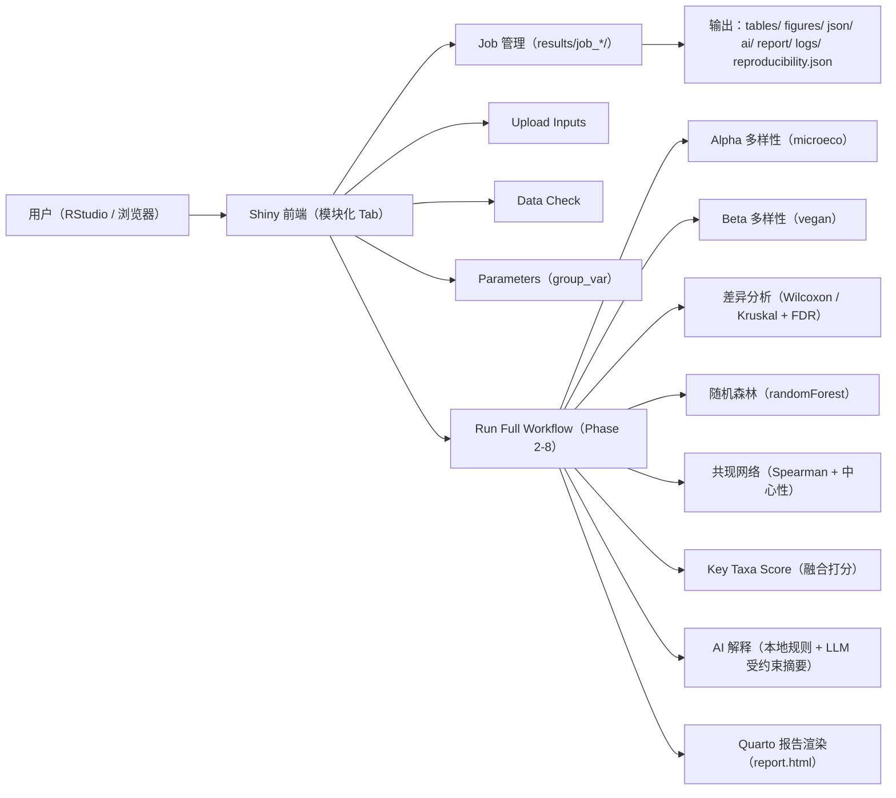

# 系统设计（SYSTEM DESIGN）

## 1. 系统总体架构
本系统定位为 **microeco 2.0 的上层应用**：以 R Shiny 提供交互式入口，以“作业（job）目录”固化每次运行的输入、参数、结果与报告，并在此基础上提供受约束的 AI 文本解释与可复现 HTML 报告生成。

核心设计目标：
- 端到端：上传三表 -> 校验 -> 参数选择 -> 一键分析 -> 结果预览 -> HTML 报告。
- 可复现：每次运行独立 job 目录；记录输入 MD5、参数与阶段信息。
- 可信解释：AI 解释只允许使用结构化统计结果与本地规则解释文本；明确不做因果/机制结论。
- 不替代 microeco：分析核心由 microeco 2.0 提供（Alpha、多层级丰度聚合等），系统侧重流程编排与结果组织。

推荐用如下数据流理解系统：

## 2. 数据输入模块（Upload Inputs）
功能：
- 接收三类文件：abundance / metadata / taxonomy（tsv/csv/txt）。
- 点击“Create Job & Save Inputs”后创建新 job 目录，并将输入固化为：
  - `results/<job_id>/input/abundance.tsv`
  - `results/<job_id>/input/metadata.tsv`
  - `results/<job_id>/input/taxonomy.tsv`

关键点：
- 统一重命名与落盘，避免后续流程依赖用户原始文件名。
- 写入可复现记录：记录输入文件 MD5 与原始文件名（写入 `reproducibility.json`）。
- 同步写入 SQLite（可选）：记录 job 元信息与文件条目（便于后续追踪）。

## 3. 数据校验模块（Data Check）
定位：
- 强制步骤，用于在分析前发现格式错误与关键字段缺失。

输出：
- `results/<job_id>/tables/data_check_summary.csv`

交互：
- 在界面中展示总体状态 `pass / warning / error` 与检查项表格。

## 4. microeco 分析模块（microeco Analysis）
系统依赖 microeco 2.0 对数据对象进行组织与基础计算（如 Alpha 多样性计算、按分类层级聚合丰度等）。

强调：
- 本系统不重新实现 microeco 的核心算法；侧重于 **调用、编排、保存与展示**。

## 5. 差异分析模块（Differential Abundance）
输入：
- microeco 数据对象中的分组信息（`group_var`）与指定分类层级（如 Genus）。

方法要点：
- 两组比较：Wilcoxon 秩和检验（`wilcox.test`）。
- 三组及以上：Kruskal-Wallis 秩和检验（`kruskal.test`）。
- 多重比较校正：FDR（`p.adjust(method="fdr")`）。

输出（job 目录）：
- `tables/differential_taxa.csv`
- `tables/differential_taxa_significant.csv`（即使无显著结果也会生成空表以保证流程稳定）
- `json/diff_summary.json`
- `figures/diff_volcano.png/.pdf`、`figures/diff_taxa_barplot.png/.pdf`

## 6. AI 可信解释模块（AI-Constrained Interpretation）
本系统将解释分为两层：

1. 本地规则解释（Phase 4A）
- 只读取已经生成的统计产物（如 `diff_summary.json`、`differential_taxa.csv`、`alpha_stats.csv`、`beta_permanova.csv`）。
- 产出三份 Markdown（写入 `ai/`）：
  - `ai/diff_interpretation.md`
  - `ai/methods.md`
  - `ai/figure_legends.md`
- 内置谨慎声明：解释为统计约束摘要，不推断因果/机制。

2. LLM 受约束摘要（Phase 4B，可选）
- 输入被严格限制：仅提供 `diff_summary.json` 与 Phase 4A 的三份 Markdown 文本。
- 关键约束（提示词规则）：
  - 只能使用提供的统计 JSON 与本地解释文本。
  - 不得提及原始 abundance 表内容。
  - 不得改变统计结论；不得把不显著结果写成显著。
  - 不得推断因果或机制。
  - 输出必须是单个 JSON，包含 `diff_interpretation/methods/figure_legends` 三个键，值为 Markdown。
- 产物留痕：
  - 请求：`json/llm_request_diff.json`
  - 响应：`json/llm_response_diff.json`
  - LLM 输出 Markdown：`ai/llm_*.md`

强调：
- AI 文本仅用于“受约束的说明/摘要”，不输出因果结论。

## 7. 机器学习模块（Random Forest）
定位：
- 用随机森林进行 **探索性** 的特征筛选与模式识别，输出特征重要性与训练集预测指标。

方法要点：
- 以指定分类层级（默认 Genus）的丰度矩阵构建特征。
- `randomForest(importance=TRUE)` 训练模型。
- 输出 feature importance 与 confusion matrix；二分类额外输出 ROC（若可计算）。
- 样本量可靠性提示（写入 `json/ml_summary.json`）：
  - `n < 20`：exploratory only
  - `20 <= n < 50`：caution
  - `n >= 50`：acceptable

强调：
- ML 输出反映预测相关模式，**不得作为因果证据**。

## 8. 网络分析模块（Spearman 共现网络）
定位：
- 在指定分类层级上做 **探索性** 的共现关系网络构建，帮助识别可能的核心节点与模块结构。

方法要点：
- 两两 Spearman 相关检验（`cor.test(method="spearman")`）。
- 对边的 p 值做 FDR 校正；筛边阈值：`abs(rho) >= rho_cutoff` 且 `fdr < p_cutoff`（默认 `0.6` 与 `0.05`）。
- 中心性：degree、betweenness（normalized）、closeness、eigenvector；并记录 connected component。

输出：
- `tables/network_nodes.csv`、`tables/network_edges.csv`
- `json/network_summary.json`
- `figures/network_plot.png/.pdf`

强调：
- 相关不等于因果；网络结构 **不应** 被解读为直接相互作用证据。

## 9. Key Taxa Score 模块
定位：
- 将三类证据（差异、ML、网络中心性）归一化后融合，输出关键菌候选排序与推荐等级（High/Medium/Low）。

证据来源与归一化：
- 差异证据：`differential_score = normalize( (-log10(FDR)) * |log2FC| )`
- ML 证据：`ml_importance_score = normalize( importance )`
- 网络证据：`network_centrality_score = normalize( degree + betweenness )`

融合策略（加权平均，按“该 taxon 实际可用证据”计算分母，避免 NA）：
- 若三源都存在：权重 `diff=0.4, ml=0.4, network=0.2`
- 若缺失某源：按预设规则自动调整（例如只有 diff+ml 则各 0.5）

输出：
- `tables/key_taxa_score.csv`
- `tables/key_taxa_top20.csv`
- `figures/key_taxa_score_barplot.png/.pdf`
- `json/key_taxa_summary.json`

强调：
- 打分是工程化融合指标，用于候选优先级排序；并不等价于“生物学因果关键性”的证明。

## 10. Quarto 报告模块
定位：
- 将 job 目录中的产物按模板渲染为可交付的 `report.html`。

实现要点：
- 使用 `templates/report_template.qmd` 作为输入模板。
- 渲染参数：`job_dir` 与 `report_ctx`（由 report_prepare 收集路径与存在性信息）。
- 渲染生成的 HTML 会被复制到：`results/<job_id>/report/report.html`

## 11. Shiny 前端模块
前端采用模块化 Tab（Upload/Data Check/Parameters/Run/Alpha/Beta/Diff/Report），核心原则：
- UI 只做交互与预览，不直接堆叠分析逻辑。
- “Run Full Workflow”负责统一编排，生成可检查的产物清单（artifact table）。

## 12. 结果存储结构（Job Output Layout）
每次运行创建：`results/job_YYYYMMDD_HHMMSS_xxxxxx/`，推荐理解为“可复现实验单元”。目录结构：
- `input/`：固化输入
- `tables/`：表格结果
- `figures/`：图形结果
- `json/`：结构化汇总与（可选）LLM 请求/响应留痕
- `ai/`：本地规则解释与（可选）LLM 摘要输出（Markdown）
- `report/`：最终 `report.html`
- `logs/`：错误信息（失败时写入 `error.log`）
- `reproducibility.json`：输入 MD5、参数与阶段记录（时间戳/权重/阈值等）

